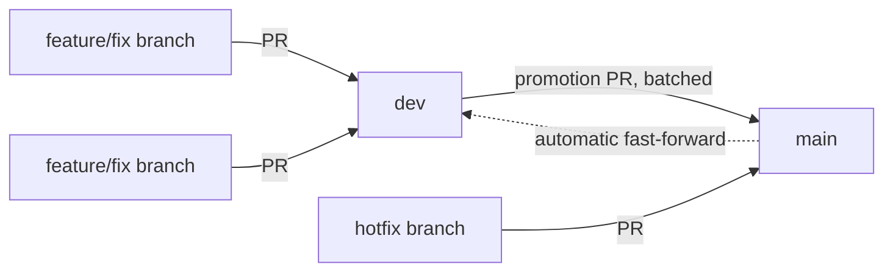

# Git Workflow

How branches and merges work in this repository, and which parts of it break things if
done differently.

Most of this is ordinary. Two things are not, and they are the reason this document
exists:

1. Promotion pull requests **must** be merged with "Create a merge commit". Squash and
   rebase silently destroy the property the whole model rests on.
2. `dev` is **fast-forwarded back to `main` after a promotion**, automatically. It is not
   a long-lived divergent branch. The sync runs on every push to `main`, but only the
   promotion case ends with the two branches at the same commit.

If you read nothing else, read those two and the [What breaks
everything](#what-breaks-everything) section.

## The shape



`main` is the default branch and what deploys. `dev` is the integration branch where day
to day work lands. Batches of `dev` are promoted to `main` through a single promotion
pull request.

The dotted line is the part people miss. After anything lands on `main`, the sync
workflow brings `dev` back up to it, and in the promotion case that is a fast-forward
which leaves the two at the **same commit**. `dev` is not a branch that drifts ahead or
behind for long, it is a staging area that is repeatedly brought back to parity.

## The invariant

> `dev` always contains `main`. After a promotion merge, with no new work on `dev` since,
> the two point at the **same commit**.

The second half is the case you will see almost always, because a promotion is cut from
`dev`'s tip and nothing usually lands in the minute it takes to merge. It is not
unconditional: a hotfix merged straight into `main` while `dev` has already moved on is
synced by a **merge** rather than a fast-forward, so `dev` then contains `main` while
sitting ahead of it. The next promotion brings them level again. See [the sync
workflow](#the-sync-workflow) for every outcome.

Verify parity at any time:

```bash
git fetch origin
git rev-parse origin/main origin/dev   # same SHA twice, between promotions

# The part that must hold unconditionally: main is contained in dev
git merge-base --is-ancestor origin/main origin/dev && echo ok || echo diverged
```

This is enforced by `.github/workflows/sync-dev-to-main.yml`, which runs on every push to
`main`. **Do not do this by hand.** The workflow exists because doing it manually meant
remembering it, and it was forgotten.

Why it matters: a promotion leaves `dev` strictly behind `main`. Every branch cut from
`dev` after that starts from stale code, and the next promotion re-proposes commits that
are already on `main`. Left alone, the two branches drift until the promotion diff stops
being reviewable. Measured on a real promotion in the repository this model came from,
`dev` ended up **37 commits behind**.

## Merge method is load-bearing

Promotion pull requests must be merged with **"Create a merge commit"**. Not "Squash and
merge", not "Rebase and merge".

A merge commit has two parents, and for a promotion one of them is the tip of `dev`:

```bash
$ git log -1 --format='%h parents=%p' origin/main
170233f parents=378707a 0fc2ce2
```

Because `dev`'s tip is an ancestor of `main`, `dev` can be **fast-forwarded** to `main`.
No force push, no history rewriting, nothing discarded. Git itself refuses anything that
is not a fast-forward, so the safety does not depend on the workflow being clever.

Squash and rebase both replace those commits with new SHAs that `dev` has never seen.
`dev` stops being an ancestor, the fast-forward becomes impossible, and recovering needs a
human. A simulated squash of one real promotion, in the repository this model came from,
left `dev` **23 behind and 25 ahead**, recoverable only by force pushing.

This is enforced by repository settings rather than discipline:

```text
allow_merge_commit  = true
allow_squash_merge  = false
allow_rebase_merge  = false
```

**Do not re-enable squash or rebase merging** without reading this section first. The
green button remembers the last method used, so with all three enabled it is genuinely
easy to squash a promotion by accident.

Note this constrains promotion and hotfix pull requests, the ones that land on `main`.
Squashing is disabled repository-wide because the setting is not per-branch.

## The sync workflow

`.github/workflows/sync-dev-to-main.yml` runs on every push to `main` and on manual
dispatch. It compares the two branches and picks one of these outcomes:

| State | Action |
|---|---|
| `dev` missing | Create it at `main` |
| `dev` equal to `main` | Nothing to do |
| `dev` behind `main` | **Fast-forward** `dev` to `main` (the promotion case) |
| `dev` ahead, contains `main` | Nothing to do. New work has landed on `dev` |
| Neither contains the other | Merge `main` into `dev`, keeping `dev`'s tip as first parent |
| That merge conflicts | Fail loudly and leave both branches untouched |

Two properties worth knowing:

- **Neither push is forced.** Git rejects anything that is not a fast-forward, so no
  outcome can discard a commit. The ancestry checks exist to pick the right case and
  produce a useful message, not to make the push safe.
- **A rejected push is retried.** If someone pushes to `dev` between the workflow reading
  the tip and pushing, the push is rejected, and the workflow refetches and decides again
  from the new tip, up to three attempts. It never reuses a merge built from a stale tip.
  Exhausting the attempts fails rather than reporting success for work that did not
  happen.

The sync pushes with `GITHUB_TOKEN`, and GitHub does not let pushes made with it
retrigger workflows. This repository has no CI on `dev` today, but when it gains some,
healing `dev` will not spend a run on it.

If the workflow fails, read the run summary before touching anything. It states both
SHAs, how far apart they are, and which case it hit.

## Everyday flows

### Feature or fix

```bash
git fetch origin
git checkout -b fix/some-thing origin/dev
# work, commit
git push -u origin fix/some-thing
# open a PR into dev
```

Base it on `dev`, target `dev`. Any merge method is fine here in principle, since these do
not land on `main` directly, though only merge commits are enabled repository-wide.

### Promotion

```bash
git fetch origin
git checkout -b release/promote-dev-YYYY-MM-DD origin/dev
git push -u origin release/promote-dev-YYYY-MM-DD
# open a PR into main
```

Merge it with **Create a merge commit**. The sync workflow fast-forwards `dev` on that
merge, and the branches are back at parity within seconds.

### Hotfix

Branch from `main`, target `main`, merge with a merge commit. The sync workflow then
carries the fix down to `dev` on the same push, so there is no separate step and no risk
of the fix being lost at the next promotion.

```bash
git checkout -b hotfix/urgent-thing origin/main
```

## Verification cheatsheet

```bash
# Are dev and main at parity?
git fetch origin && git rev-parse origin/main origin/dev

# Was the last thing on main a real merge commit? (two parents = yes)
git log -1 --format='%h parents=%p %n  %s' origin/main

# How far apart are they, and in which direction?
git rev-list --left-right --count origin/dev...origin/main

# Can dev be fast-forwarded to main?
git merge-base --is-ancestor origin/dev origin/main && echo yes || echo no

# Which merge methods does the repository allow?
gh api repos/{owner}/{repo} \
  --jq '{merge: .allow_merge_commit, squash: .allow_squash_merge, rebase: .allow_rebase_merge}'
```

## What breaks everything

- **Squashing or rebasing a promotion pull request.** Destroys the ancestry the
  fast-forward depends on. Recovery needs a force push and a human decision.
- **Re-enabling squash or rebase merging** in repository settings, which makes the above
  possible again by accident.
- **Force pushing `main` or `dev`.** Nothing in this workflow needs it. If you think you
  need it, something else is wrong.
- **Fast-forwarding `dev` by hand while the workflow is also running.** Let the workflow
  own it.
